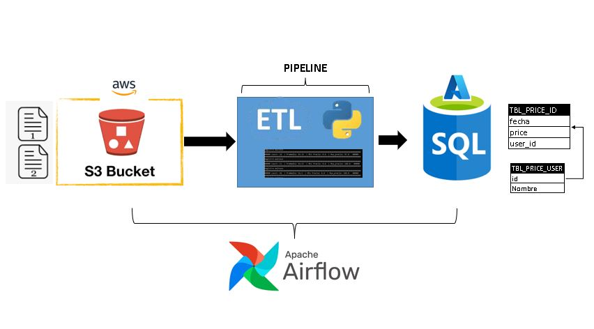
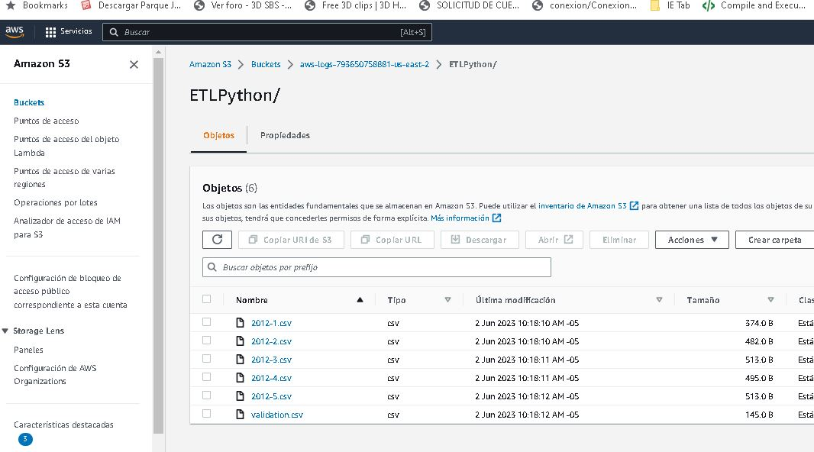
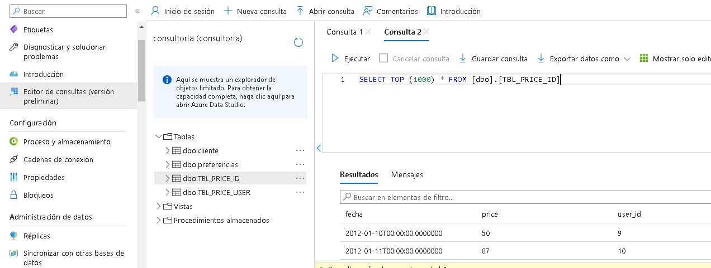
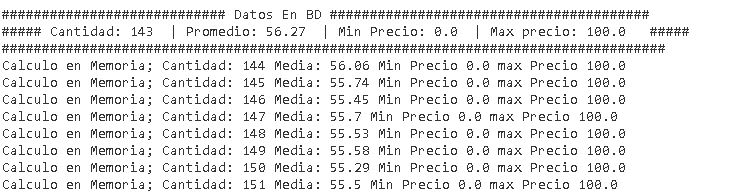

# ETL micro Batches.

Este proyecto se desarrolla como ejercicio de PRAGMA S.A, por lo cual no cuenta con información real.
Desarrollado bajo Python, AWS y Azure, se plantea una solución a un problema de carga de lotes de información en tiempo real. El proceso está en constante ejecución, buscando nuevos archivos en orden de fecha (simulados en secuencias de 1..n), mostrando estadísticas de carga, tanto de BD como calculadas en memoria y reciclado de memoria, haciendo más ágil el proceso.

En la siguiente imagen se observa el proyecto planteado para dar solución al reto. No se implementa la parte de AirFlow por falta de tiempo y recursos Linux.



## Pasos

### Paso 1: Directorio de trabajo

En esta etapa, se creó el modelo utilizando Colab, aprovechando la potencia de la GPU para su entrenamiento. Se utilizaron imágenes de personas borrachas y no borrachas obtenidas de fuentes externas. La estructura de directorios utilizada para el conjunto de datos fue la siguiente:

    --data        
    --Salidas
        --Validacion.txt (salidas del archivo final por pipeline)
        --Normal.txt (salidas del archivo paso de micro batches)
    --imagenes
    --main.py (archivo de ejecución llama al pipeline)
    --pipeline_ETL.py 

Ejecucion: python main.py "Validacion"

- Paquetes necesarios: `pymssql`,`s3fs`,`Pandas`


### Paso 2: Configuración de origen y destino 

El origen se pensó en un bucket S3 de AWS simulando un datalake



El destino se pensó en una base de datos relacional en este caso en otra nube Azure



### Paso 3: Pipeline

Construido con Python para mostrar la elasticidad del proceso, el mismo puede ser implementado en una solución como Azure DataFactory o AWS Glue. Contiene funciones para:
    1. Leer archivo de fuente local como en la nube
    2. Transformar los datos ajustando fechas y valores faltantes
    3. Cargar los datos y generar estadísticas durante todo el proceso

### Paso 4: Resultados

Los resultados se muestran en pantalla durante la ejecución y pueden ser capturados por otro programa de orquestación como AirFlow.



## Instalación

1. Clonar el repositorio a tu máquina local:

   ```bash
   git clone https://github.com/ijlm/ETL-AWS-AZURE-Python.git

    conda create -n etl-python python=3.10
    conda activate etl-python

    pip install -r requirements.txt

    
